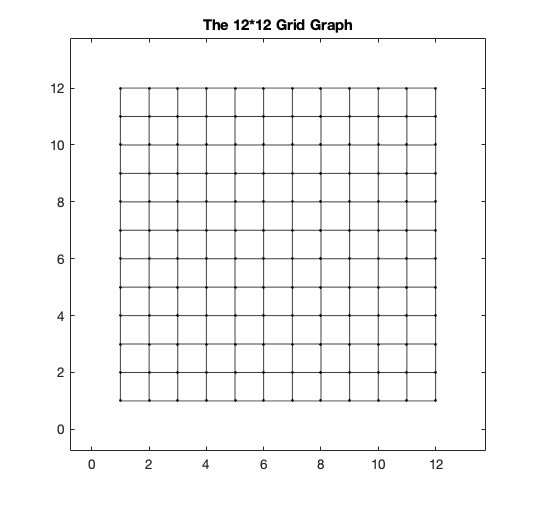
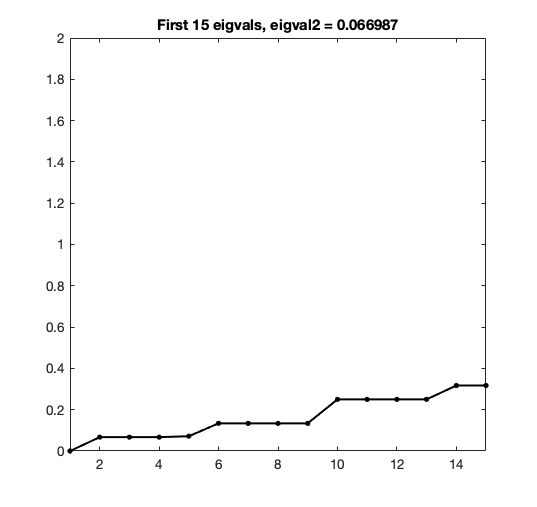
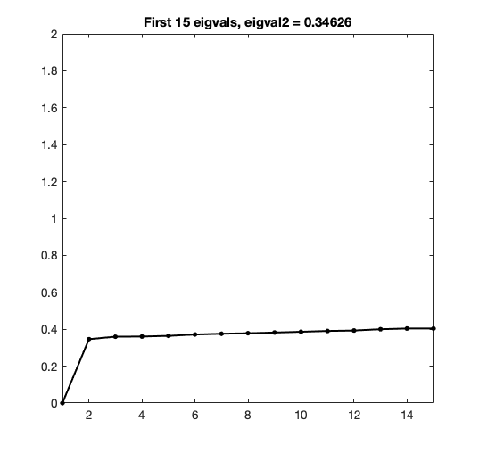
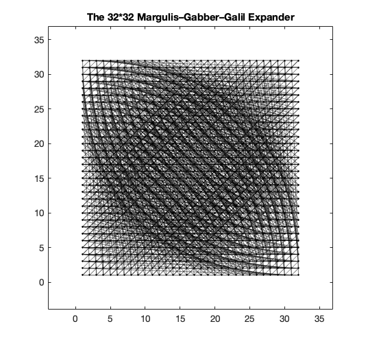
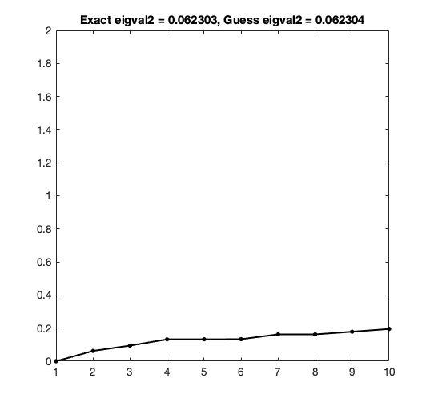

<h1 align="center">The Second Laplacian Eigenvalue</h1>

<i>A survey on the second smallest Laplacian eigenvalue    and its applications.</i>

 

This project reveals the relationship between   and the connectivity of a graph.

## Contents
- [Introduction](#Introduction)
    - [Normalized Laplacian](#Normalized-Laplacian)
    - [Eigenvalue of Normalized Laplacian](#Eigenvalue-of-Normalized-Laplacian)
    - [Conductance of Graph](#Conductance-of-Graph)
    - [Cheeger's Inequality](#Cheeger's-Inequality)

- [Small Second Eigenvalue](#Small-Second-Eigenvalue) 
    - [Image Partition](#Image-Partition)

- [Large Second Eigenvalue](#Large-Second-Eigenvalue) 
    - [Algebraic Construction](#Algebraic-Construction)  
    - [Combinatorial Construction](#Combinatorial-Construction)  

- [References](#References)

## Introduction

### Normalized Laplacian

  

where *A* is the adjacency matrix and *D* is a diagonal matrix with degree of vertices on its diagonal.  

 - Symmetric, singular, positive semidefinite.  
 - Measure the smoothness of a vector *x*.  

 

### Eigenvalue of Normalized Laplacian

 - Eigenvalues are between 0 and 2.  
 - The smallest eigenvalue of Laplacian is always equal to 0, and its eigenvector is the all-one vector.  
 - The multiplicity of the 0 eigenvalue is equal to the number of connected component a graph has.   
 - The largest eigenvalue is 2 iff a graph is bipartite.  

 

### Conductance of Graph

 - For a graph *G* = (*V*,*E*), conductance of a vertex subset *S* is (number of boundary of *S*) / min( number of vertex in *S*, number of vertex in *V-S* ).  

 - Conductance of a graph is the smallest conductance of vertex subset *S* with size < |*V*| / 2 .  

 

### Cheeger's Inequality

  

Right side indicates:  
 - Small    implies small conductance.  
 - Small conductance implies that its corresponding eigenvector provide a good cut.  

Left side indicates:  
 - Large    implies large conductance.  
 - Large conductance implies that the graph is well-connected and is an expander.  

 

## Small Second Eigenvalue

### Introduction

Intuitively, graphs that can be easily divided into two have small     :

(See images in the `images_readme` file.)

    
    
    
    

  

Surprisingly, planar graphs also have small    [3] :

    
    
    
    

  

This fascinating property of planar graphs lead me to the next topic: image partition using the Laplacian of planar graph.  
(See how Random Walk matrix is also used in image partition in [my previous project of diffusion maps](https://github.com/yujieho/Image_Partition)!)

 

### Image Partition

Implement in `IP-L.ipynb`.  

 

***:round_pushpin: Framework***

The construction is refer to [Professor Spielman's Matlab code](http://www.cs.yale.edu/homes/spielman/sgta/), where also provides a fascinating talk of Spectral Graph Theory.  

1. Construct a planar graph on the image.  
2. Compute the Laplacian.  
3. Compute    and its corresponding eigenvector.  
4. Divide the image into 2 using the eigenvector.  
    (An eigenvector assigns each vertex/pixel a number, simply puts positive ones to a group and non-positive ones to another.)  

 

***:round_pushpin: Demonstration***

For the results, the eigenvector cut the down-sampled version of image into 2 parts: the part with read filter and the remain part.

`images_LP-L/cat.jpg`. Left: original image. Right: result image, size: 90 * 140.  

    
    

`images_IP-L/fruit3.jpg`. Left: original image. Right: result image, size: 130 * 100.  

    
    

`images_IP-L/fruit4.jpg`. Left: original image. Right: result image, size: 80 * 80.  

    
    

See more results in `results_IP-L`.

 

***:round_pushpin: Conclusion***

Various ways to have a clearer contour:

1. Define a better weight for each edge.  
2. Find a better selection of the eigenvector indices.

 

## Large Second Eigenvalue

### Introduction

Expander graphs have various theories in mathematics and applications in computer science.  

A 'good' expander graph is a graph with few edges but still well-connected.  

I will introduce some properties and explicit constructions of a good d-regular expander.  

 

***:round_pushpin: Properties***

- Every vertex subset has many neighbors, by the definition of the conductance.  

- It is a sparsification of the complete graph. That is, they have similar spectrums of eigenvalues and eigenvectors, but the expander has much less edges.  

- It acts like a random d-regular graph when it has many vertices, by the mixing lemma.  

- A random walk on it converges quickly to the stationary distribution, by the random walk lemma.  

 

***:round_pushpin: Some expanders***

    
    
    

  

    
    
    

  

 

***:round_pushpin: Expander family***

An infinite family Gn of d-regular graphs with second Laplacian eigenvalue bounded from below by a constant c, where d and c are independent of n.  

Constructing such family is useful in computer science.

In `expander`, I implements 2 strategies using Matlab, one is algebraic and the other is combinatorial.  

Descriptions are in the following subsections.

 

***:round_pushpin: Difficulty***

Since `eigs` become very slow when *n* is large, I use power method with Rayleigh quotient and matrix deflation technique to find  .  

The algorithm can be seen in `expander/myeig.m`.

 

### Algebraic construction

Constructing the Margulis–Gabber–Galil expander.

- Simple to construct.  
- Hard to analyze the expansion via second eigenvalue.  

 

***:round_pushpin: Properties***

For a given *n*:

- The graph has *n* x *n* vertices.  
- The graph is 8-regular.  
- The graph has multi-edges and self-loops.  
- There exist a constant *c > 0* such that  is larger than *c*  for all *n*. [2] 

 

***:round_pushpin: Framework***

A vertex is a pair from {0, 1, ..., n-1} x {0, 1, ..., n-1}.

The group operation is coordinate-wise addition modulo n.

Connected vertex (a,b) to:

- (a+-1,b)  
- (a,b+-1)  
- (a+-b,b)  
- (a,b+-a)  

The algorithm can be seen in `expander/Margulis.m`.

 

***:round_pushpin: Demonstration***

	n = 12, eigval2 = 0.1316  
	n = 24, eigval2 = 0.073992  
	n = 32, eigval2 = 0.062304  
	n = 64, eigval2 = 0.046192  
	n = 100, eigval2 = 0.040619  

    
    
    

    
    
    

See images in `results_M_expander`.

 

***:round_pushpin: Comparison***

Since the Marguli-Gabber-Galil expander only add a few edges to each vertex of the grid graph and is a 8-regular graph, I think it interesting to compare  of the grid graph, the random 8-regular graph, and the Marguli-Gabber-Galil expander.

| number of vertex | Grid graph | Marguli-Gabber-Galil expander | Random 8-regular graph |
| :----------------  | :----------------: | :----------------: | :----------------: |
| 12*12 | 0.0669 | 0.1316 | 0.3817 |
| 24*24 | 0.0170 | 0.0739 | 0.3462 |

The random graphs seems to be better expanders than the Marguli-Gabber-Galil expanders.  

This is reasonable since the Marguli-Gabber-Galil expanders have many multi-edges.

 

### Combinatorial construction

Constructing expanders using zig-zag product and tensor product.

- Based on iterations.  
- Simple to analyze the expansion via second eigenvalue.  

 

***:round_pushpin: Framework of zig-zag product***

For a *d*-regular graph H with *h* vertices, and a *h*-regular graph G with *g* vertices:

1. Multiple vertices of H to each vertex of G, i.e., forming *g* clouds, each cloud has *h* vertices.  
2. Take a step in one cloud.
3. Take a step to another cloud.
4. Take a step in the new cloud.

 

## References
[1] [Course: Spectral Graph Theory, Daniel A. Spielman, Yale.](http://www.cs.yale.edu/homes/spielman/561/syllabus.html)  
[2] [Course: Graph Partitioning, Expanders and Spectral Methods, Luca Trevisan, UC Berkeley.](https://people.eecs.berkeley.edu/~luca/expanders2016/)  
[3] Spectral partitioning works: Planar graphs and finite element meshes, Daniel A. Spielman and Shang-Hua Teng, Linear Algebra and its Applications, 421:284–305, 2007.
