<h1 align="center">The Second Laplacian Eigenvalue</h1>

<i>A survey on the second smallest Laplacian eigenvalue  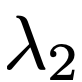  and its applications.</i>

 

This project reveals the relationship between   and the connectivity of a graph.

## Contents
- [Introduction](#Introduction)

    - [Normalized Laplacian](#Normalized-Laplacian)
    - [Eigenvalue of Normalized Laplacian](#Eigenvalue-of-Normalized-Laplacian)
    - [Conductance of Graph](#Conductance-of-Graph)
    - [Cheeger's Inequality](#Cheeger's-Inequality)

- [Small Second Eigenvalue](#Small-Second-Eigenvalue) 

    - [Image Partition](#Image-Partition)

- [Large Second Eigenvalue](#Large-Second-Eigenvalue) 

    - [The Marguli-Gabber-Galil Expander Construction](#The-Marguli-Gabber-Galil-Expander-Construction)  

- [References](#References)

## Introduction

### Normalized Laplacian

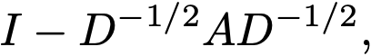
  

where *A* is the adjacency matrix and *D* is a diagonal matrix with degree of vertices on its diagonal.  

 - Symmetric, singular, positive semidefinite. 

 - Measure the smoothness of a vector *x*.  

### Eigenvalue of Normalized Laplacian

 - Eigenvalues are between 0 and 2.  

 - The smallest eigenvalue of Laplacian is always equal to 0, and its eigenvector is the all-one vector.

 - The multiplicity of the 0 eigenvalue is equal to the number of connected component a graph has.  

 - 
	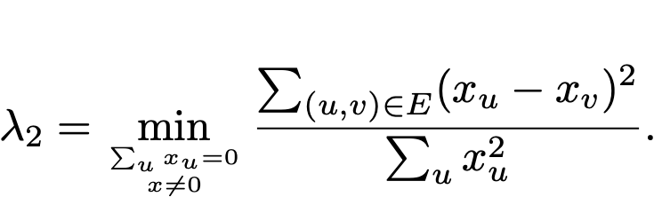

 - The second smallest eigenvalue is 0 iff the graph is disconnected.

 - The largest eigenvalue is 2 iff a graph is bipartite.  

### Conductance of Graph

 - For a graph *G* = (*V*,*E*), conductance of a vertex subset *S* is (number of boundary of *S*) / min( number of vertex in *S*, number of vertex in *V-S* ).  

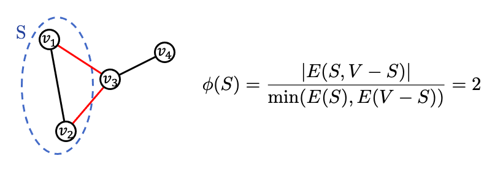

 - Conductance of a graph is the smallest conductance of a vertex subset *S* with size < |*V*| / 2 .  

### Cheeger's Inequality

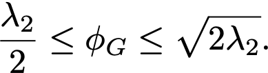
  

Right side indicates:  
 - Small    implies small conductance.  
 - Small conductance implies its corresponding eigenvector is a good cut.  

  

Left side indicates:  
 - Large    implies large conductance.  
 - Large conductance implies that the graph is well-connected and is an expander.  

## Small Second Eigenvalue

### Introduction

Intuitively, graphs that can be easily divided into two have small     :

(See images in the `readmeimg` file.)

    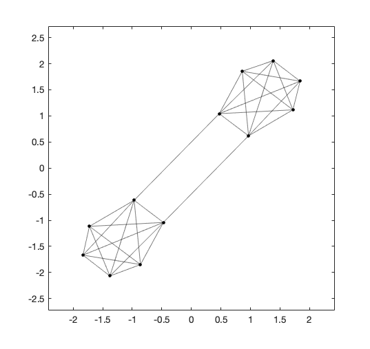
    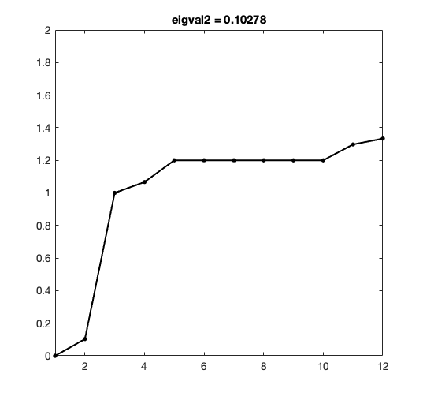
    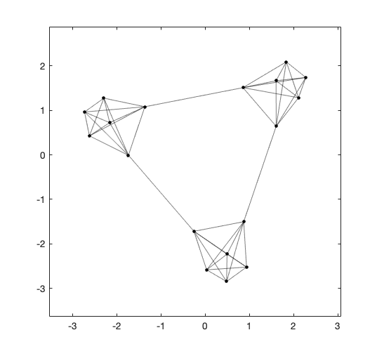
    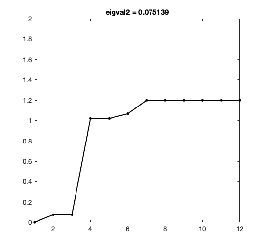

  

Surprisingly, planar graphs also have small    [3] :

    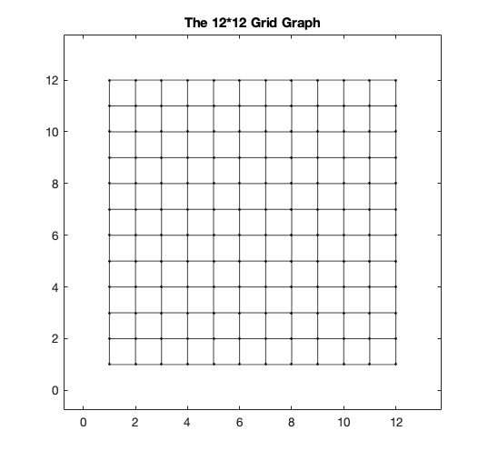
    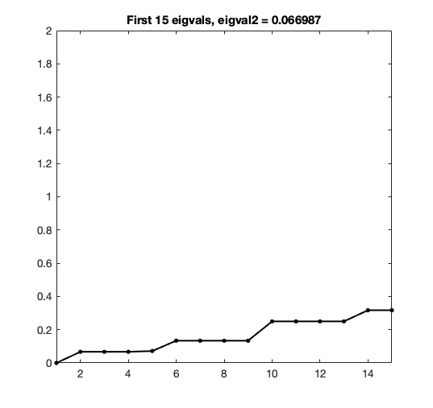
    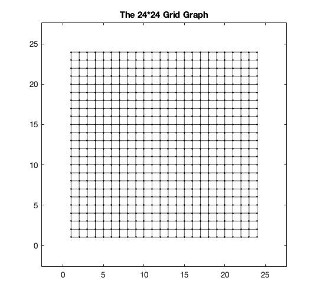
    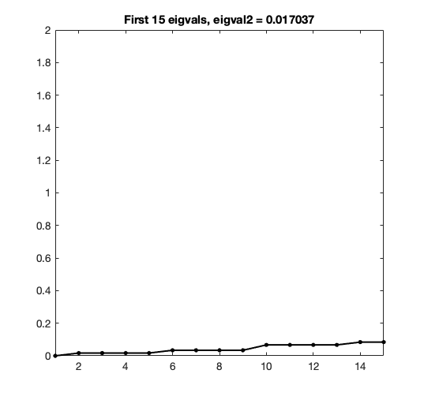

  

This fascinating property of planar graphs lead me to the next topic: image partition using the Laplacian of planar graph.  
(See how Random Walk matrix also benefit to image partition in [my previous project of diffusion maps](https://github.com/yujieho/Image_Partition)!)

### Image Partition

***:round_pushpin: Framework***

The construction is refer to [Professor Spielman's Matlab code](http://www.cs.yale.edu/homes/spielman/sgta/), where also provides a fascinating talk of Spectral Graph Theory.  

1. Construct a planar graph on the image.
2. Compute the Laplacian.
3. Compute    and its corresponding eigenvector.  
4. Divide the image into 2 using the eigenvector.  
    (An eigenvector assigns each vertex/pixel a number, simply puts positive ones to a group and non-positive ones to another.)  

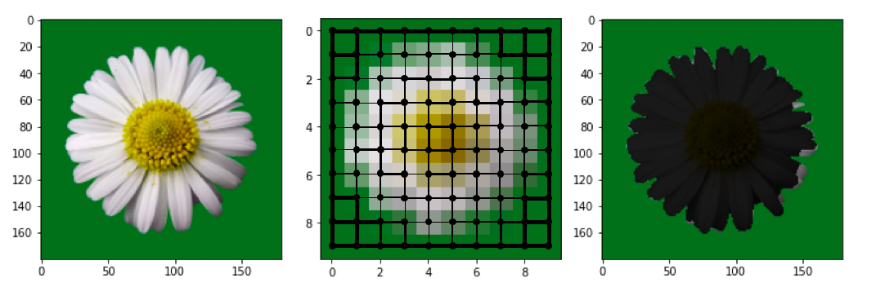

See implementation in `image_partition_L.ipynb`.  

***:round_pushpin: Demonstration***

For the results, the eigenvector cut the down-sampled version of image into 2 parts: the part with read filter and the remain part.

`images/cat.jpg`, left: original image, right: result image with size 90 * 140.  

    
    

`images/fruit3.jpg`, left: original image, right: result image with size 130 * 100.  

    
    

`images/fruit4.jpg`, left: original image, right: result image with size 80 * 80.  

    
    

See more results in the `image_partition_results` file.

***:round_pushpin: Conclusion***

Various ways to improve the performance:

1. Find a better weight for each edge.
2. Find a better selection of the eigenvector indices.

## Large Second Eigenvalue

### Introduction

For a good d-regular expander:

 - Every vertex subset has many neighbors, by the definition of the conductance.  
 - It has few edges compare to the number of its vertices.  
 - It is a sparsification of the complete graph. That is, they have similar spectrums of eigenvalues and eigenvectors, but the expander has much less edges.  
 - It acts like a random graph when it has many vertices, by the expander mixing lemma.  

***:round_pushpin: Some expanders***

    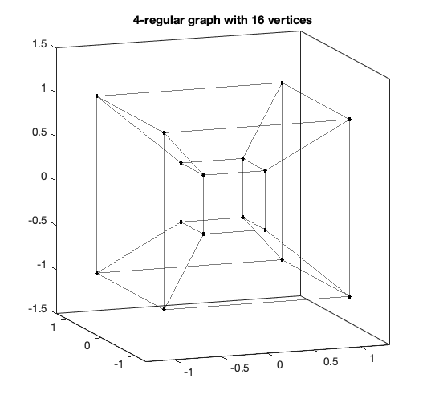
    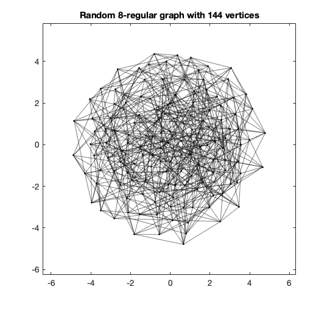
    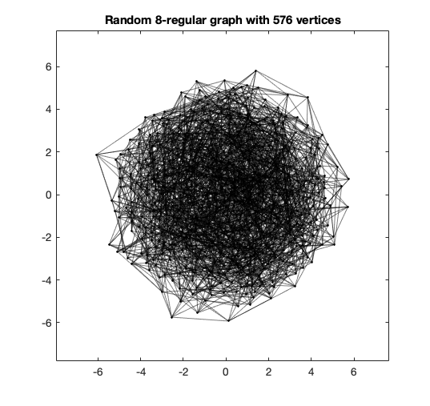

  

    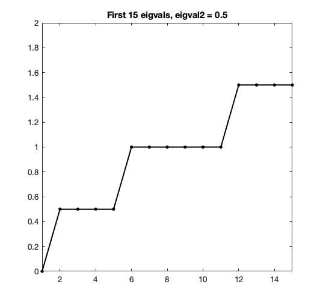
    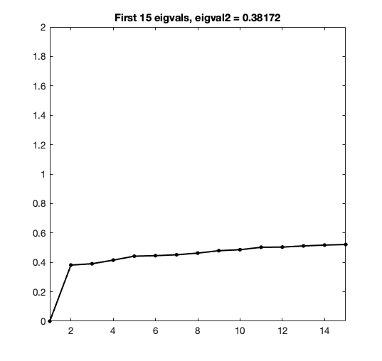
    

  

***:round_pushpin: Expander families***

It is useful to construct an infinite families of *d*-regular expanders with constant *d* and constant lower bound of  .  

There are 2 strategies that I implement  using Matlab.  

Implementations are in the `expander` file, where descriptions are in the following sections.  

***:round_pushpin: Difficulty***

Since `eigs` become very slow when *n* is large, I use power method with Rayleigh quotient and matrix deflation technique to find  .  

### The Marguli-Gabber-Galil Expander Construction

This is a simple explicit construction of an infinite family of 8-regular expanders.  

***:round_pushpin: Framework***

For a given *n*, construct a graph with *n x n* vertices.  

Consider a vertex as a pair from {0,...,*n* − 1} × {0,...,*n* − 1}, where the group operation is coordinate-wise addition modulo *n*.  

Connected vertex (a,b) to (a+1,b), (a-1,b), (a,b+1), (a,b-1), (a+b,b), (a-b,b), (a,b+a), (a,b-a).  

The graph is a 8-regular graph with multi-edges and self-loops.

One can prove that there exist a constant *c > 0* such that   for all *n*. [2]

***:round_pushpin: Demonstration***

	n = 12, eigval2 = 0.1316  
	n = 24, eigval2 = 0.073992  
	n = 32, eigval2 = 0.062304  
	n = 64, eigval2 = 0.046192  
	n = 100, eigval2 = 0.040619  

    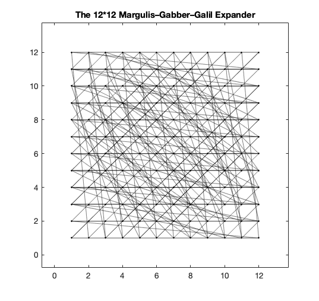
    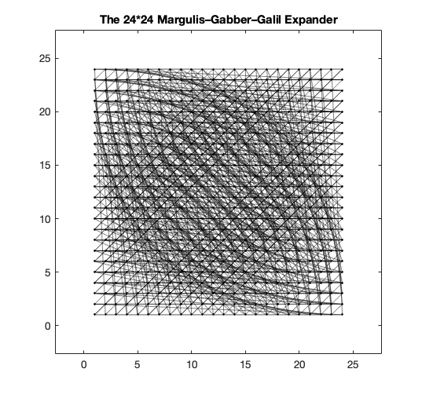
    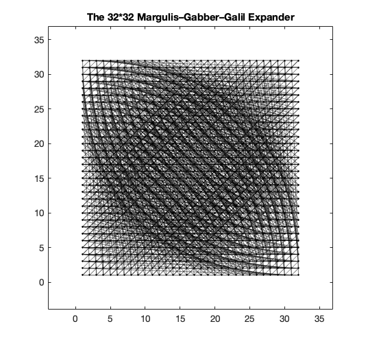

    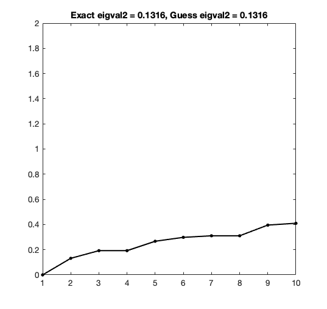
    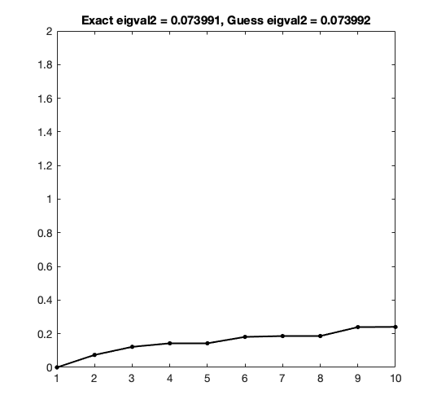
    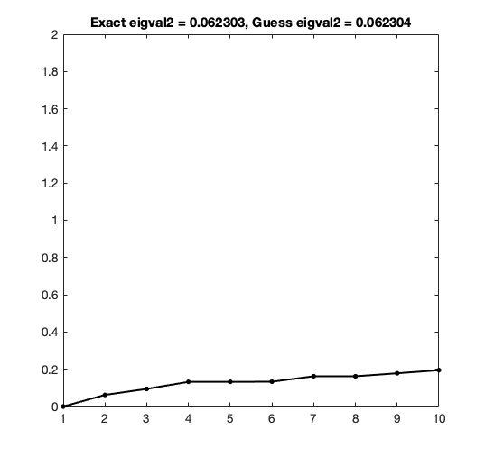

See images in the `expander_results` file.

***:round_pushpin: Comparison***

Since the Marguli-Gabber-Galil expander only add a few edges to each vertex of the grid graph and is a 8-regular graph, I think it interesting to compare  of the grid graph, the random 8-regular graph, and the Marguli-Gabber-Galil expander.

| number of vertex | Grid graph | Marguli-Gabber-Galil expander | Random 8-regular graph |
| :----------------  | :----------------: | :----------------: | :----------------: |
| 12*12 | 0.0669 | 0.1316 | 0.3817 |
| 24*24 | 0.0170 | 0.0739 | 0.3462 |

The random graphs seems to be better expanders than the Marguli-Gabber-Galil expanders.  

This is reasonable since the Marguli-Gabber-Galil expanders have many multi-edges.

## References
[1] [Course: Spectral Graph Theory, Daniel A. Spielman, Yale.](http://www.cs.yale.edu/homes/spielman/561/syllabus.html)  
[2] [Course: Graph Partitioning, Expanders and Spectral Methods, Luca Trevisan, UC Berkeley.](https://people.eecs.berkeley.edu/~luca/expanders2016/)  
[3] Spectral partitioning works: Planar graphs and finite element meshes, Daniel A. Spielman and Shang-Hua Teng, Linear Algebra and its Applications, 421:284–305, 2007.
