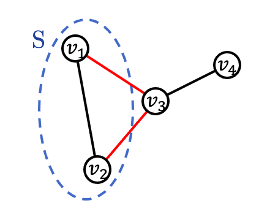

<h1 align="center">The Second Laplacian Eigenvalue</h1>

<i>A survey on the second smallest Laplacian eigenvalue  and its applications.</i>

 

This project reveals the relationship between  and the connectivity of a graph.

## Contents
- [Introduction](#Introduction)

    - [Normalized Laplacian](#Normalized-Laplacian)
    - [The Laplacian Eigenvalue](#The-Laplacian-Eigenvalue)
    - [Conductance](#Conductance)
    - [Cheeger's Inequality](#Cheeger's-Inequality)

- [Small ](#Small)

    - [Introduction](#Introduction)
    - [Image Partition](#Image-Partition)

- [Large ](#Large)

    - [Introduction](#Introduction)
    - [The Marguli-Gabber-Galil Expander](#The-Marguli-Gabber-Galil-Expander)
    - [The Zig-Zag Product](#The-Zig-Zag-Product)

- [References](#References)

## Introduction

### Normalized Laplacian

1. , where *A* is the adjacency matrix and *D* is a diagonal matrix with degree of vertices on its diagonal.  

2. Symmetric, singular, positive semidefinite. 

3. Measure the smoothness of a vector *x*.  

### The Laplacian Eigenvalue

1. Eigenvalues  *i* = 1, 2, ..., n are between 0 and 2.  

2. The smallest eigenvalue of Laplacian is always equal to 0, and its eigenvector is the all-one vector.

3. The number of  = 0 is equal to the number of connected component a graph has.  

4. 

5. = 0 iff the graph is disconnected.

  

6. The largest eigenvalue is equal to 2 if a graph is bipartite.  

### Conductance

1. For a graph *G = (V,E)*, conductance of a vertex subset *S* is (number of boundary of *S*) / min( number of vertex in *S*, number of vertex in *V-S* ).  

    
    

2. Conductance of a graph is the smallest conductance of a vertex subset *S* with size < |*V*|/2 .  

### Cheeger's Inequality

1. 

  

2. Right side indicates:  
    - Small  implies small conductance.
    - Small conductance implies its corresponding eigenvector is a good cut.
  

3. Left side indicates:  
    - Large  implies large conductance. 
    - The graph is well-connected and is an expander.

## Small 

### Introduction

:mag: Intuitively, graphs that can be easily divided into two have small :
  

:mag: Surprisingly, planar graphs also have small  [3](#3) :

This lead me to the next topic: image partition using the Laplacian of planar graph.

### Image Partition

Interesting to found Laplacian also contribute in image partition, after finished the project of [image partition using the Random Walk matrix](https://github.com/yujieho/Image_Partition).

#### Framework

The construction is refer to [Professor Spielman's Matlab code](http://www.cs.yale.edu/homes/spielman/sgta/), where also provides a fasinating talk of Spectral Graph Thoery.  

1. Construct a planar graph on the image.
2. Compute the Laplacian.
3. Compute  and its corresponding eigenvector.  
4. Divide the image into 2 using the eigenvector.  
    (An eigenvector assigns each vertex/pixel a number, simply puts positive ones to a group and non-positive ones to another.)  

See implementation in `image_partition_L.ipynb`.  

#### Demonstration

For the results, the eigenvector cut the down-sampled version of image into 2 parts, the part with read filter and the remain part.

:pencil2: `images/cat.jpg`, left: original image, right: result image with size 90 * 140.  

    
    

:pencil2: `images/daisy.jpg`, left: original image, right: result image with size 200 * 200.  
    
    

:pencil2: `images/fruit4.jpg`, left: original image, right: result image with size 80 * 80.  

    
    

See more results in the `image_partition_results` file.

#### Conclusion

Various ways to improve the performance:

1. Find a better weight for each edge.
2. Find a better selection of the eigenvector indices.

## Large 

### Introduction

For a good d-regular expander:

1. Every vertex subset has many neighbors, by the definition of the conductance. 

2. It has few edges compare to the number of its vertices.  

3. It is a sparsification of the complete graph. That is, they have similar spectrums of eigenvalues and eigenvectors, but the expander has much less edges.  

4. It acts like a random graph when it has many vertices.  

Some expanders: 

:mag: A goal here is to construct a infinite families of *d*-regular expanders with constant *d* and constant lower bound of .  

There are 2 strategies that I implement using Matlab. Discribe inthe following sections.  

:mag: Note that computing  become expensive when *n* is large, I use power method with Rayleigh quotient and matrix deflation technique to deal with this problem.  

### The Marguli-Gabber-Galil Expander

This is a simple explicit construction of expanders.  

#### Framework

For a given *n*, construct a graph with *n x n* vertices.  
Consider a vertex as a pair from {0,...,*n* − 1} × {0,...,*n* − 1}, where the group operation is coordinate-wise addition modulo *n*.  
Connected vertex (a,b) to (a+1,b), (a-1,b), (a,b+1), (a,b-1), (a+b,b), (a-b,b), (a,b+a), (a,b-a).  
The graph is a 8-regular graph with multi-edges and self-loops.

One can prove that there exist a constant *c > 0* such that  for all *n*. [2](#2)

#### Demonstration

#### The Zig-Zag Product

## References
[1] [Course: Spectral Graph Theory, Daniel A. Spielman, Yale.](http://www.cs.yale.edu/homes/spielman/561/syllabus.html)  
[2] [Course: Graph Partitioning, Expanders and Spectral Methods, Luca Trevisan, UC Berkeley.](https://people.eecs.berkeley.edu/~luca/expanders2016/)  
[3] Spectral partitioning works: Planar graphs and finite element meshes, Daniel A. Spielman and Shang-Hua Teng, Linear Algebra and its Applications, 421:284–305, 2007.
