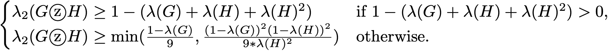

<h1 align="center">The Second Laplacian Eigenvalue</h1>

<i>A survey on the second smallest normalized Laplacian eigenvalue and its applications.</i>

 

The second smallest normalized Laplacian eigenvalue (I will call it *lambda2* for short) is closely related to the connectivity of a graph. Cheeger inequality states that graphs with a small one can be easily divided into two, and graphs with a large one are highly connected. In this project, I will introduce graphs with small and large *lambda2* and their applications.

 
 

# Contents
- [Preliinaries](#Preliinaries)
    - [Normalized Laplacian](#Normalized-Laplacian)
    - [Eigenvalue of Normalized Laplacian](#Eigenvalue-of-Normalized-Laplacian)
    - [Conductance of Graph](#Conductance-of-Graph)
    - [Cheeger's Inequality](#Cheeger's-Inequality)

- [Small *lambda2*](#Small-lambda2) 
    - [Image Partition](#Image-Partition)

- [Large *lambda2*](#Large-lambda2) 
    - [Expander](#Expander)
    - [Algebraic Construction](#Algebraic-Construction)  
    - [Combinatorial Construction](#Combinatorial-Construction)  

- [References](#References)

 
 

# Preliinaries

## Normalized Laplacian

  

where *A* is the adjacency matrix and *D* is a diagonal matrix with degree of vertices on its diagonal.  

 - Symmetric, singular, positive semidefinite.  
 - Measure the smoothness of a vector *x*.  

 

## Eigenvalue of Normalized Laplacian

 - Eigenvalues are between 0 and 2.  
 - The smallest eigenvalue of Laplacian is always equal to 0, and its eigenvector is the all-one vector.  
 - The multiplicity of the 0 eigenvalue is equal to the number of connected component a graph has.   
 - The largest eigenvalue  is 2 iff a graph is bipartite.  

 

## Conductance of Graph

 - For a graph *G* = (*V*,*E*), conductance of a vertex subset *S* is the number of boundary of *S* divided by |*S*| or |*V-S*|, depend on who has less vertices.

 - Conductance of a graph is the smallest conductance of some vertex subset *S* with size < |*V*| / 2 .  

 

## Cheeger's Inequality

  

Moreover, 

  

Right side indicates:  
 - Small *lambda2* implies small conductance.  
 - Small conductance implies that it can be easily divided into 2.  
 - The eigenvector of *lambda2* provides a good cut.  

Left side indicates:  
 - Large *lambda2* implies large conductance.  
 - Large conductance implies that the graph is well-connected and is an expander.  

 
 

# Small *lambda2*

## Examples

Graphs with a bottle neck have small *lambda2*  :

    
    

  

    
    

  

Planar graphs also have small *lambda2* [3] :

    
    

  

    
    

  

This fascinating property of planar graphs lead me to the next topic: image partition using the Laplacian of planar graph.  
(See how Random Walk matrix is also used in image partition in [my previous project of diffusion maps](https://github.com/yujieho/Image_Partition)!)

 

## Image Partition

Implement in `IP-L.ipynb`.  

 

### Framework

The construction is refer to [Professor Spielman's MATLAB code](http://www.cs.yale.edu/homes/spielman/sgta/), where also provides a fascinating talk of Spectral Graph Theory.  

1. Construct a planar graph on the image.  
2. Compute the Laplacian.  
3. Compute *lambda2* and its eigenvector.  
4. Divide the image into 2 using the eigenvector.  
    (An eigenvector assigns each vertex/pixel a number, simply puts positive ones to a group and non-positive ones to another.)  

 

### Demonstration

For the results, the eigenvector cut the down-sampled version of image into 2 parts: the part with read filter and the remain part.

:writing_hand: `images_LP-L/cat.jpg`. Left: original image. Right: result image, size: 90 * 140.  

    
    

:writing_hand: `images_IP-L/fruit3.jpg`. Left: original image. Right: result image, size: 130 * 100.  

    
    

:writing_hand: `images_IP-L/fruit4.jpg`. Left: original image. Right: result image, size: 80 * 80.  

    
    

See more results in `results_IP-L`.

 

### Conclusion

Various ways to have a clearer contour:

1. Define a better weight for each edge.  
2. Find a better selection of the eigenvector indices.

 
 

# Large *lambda2*

## Expander

A graph with a large *lambda2* is an expander. 'Good' expanders are graphs with few edges but still well-connected, they have various theories in mathematics and applications in computer science. 

I will introduce some properties and explicit constructions of good d-regular expanders.  

 

### Properties

- Every vertex subset has many neighbors, by the definition of the conductance.  
- It is a sparsification of the complete graph. That is, they have similar spectrums of eigenvalues and eigenvectors, but the expander has much less edges.  
- It acts like a random d-regular graph when it has many vertices, by the mixing lemma.  
- A random walk on it converges quickly to the stationary distribution, by the random walk lemma.  

 

### Some expanders

    
    

  

    
    

  

 

### Construct expander family

Expander family is an infinite family Gn of d-regular graphs with *lambda2* bounded from below by a positive constant c, where d and c are independent of n. Constructing such family is useful in computer science.

In `expander`, I implements 2 strategies using MATLAB, one is algebraic and the other is combinatorial, describe in the following sections.  

 

### Difficulty

Since `eigs` become very slow when *n* is large, I use power method with Rayleigh quotient and matrix deflation technique to find *lambda2*after the construction.  

The algorithm can be seen in `expander/myeig.m`.

 
 

## Algebraic construction

Implement in `expander/Margulis.m`.  

Constructing the Margulis–Gabber–Galil expander. 

- Simple to construct.  
- Hard to analyze the expansion via *lambda2*.  

 

### Framework

A vertex is a pair from {0, 1, ..., n-1} x {0, 1, ..., n-1}. Connected vertex (a,b) to:

- (a+-1, b)  
- (a, b+-1)  
- (a+-b, b)  
- (a, b+-a)  

The group operation is coordinate-wise addition modulo n.

 

### Properties

For all natural number n, the graph:

- It is 8-regular.  
- It has n*n vertices.  
- It has multi-edges and self-loops.  
- Its *lambda2* is larger than 1/294. [2, lecture 18] 

 

### Demonstration

	n = 12, lambda2 = 0.11339  
	n = 24, lambda2 = 0.067516  
	n = 36, lambda2 = 0.054649  
	n = 60, lambda2 = 0.044917  
	n = 100, lambda2 = 0.041554  
    n = 120, lambda2 = 0.040094  

(See results in `results_M_expander`.)

    
    

    
    

 

## Combinatorial construction

Constructing expanders using zig-zag product and tensor product. [4]  

- Based on iterations.  
- Simple to analyze the expansion via *lambda2*.  

 

### The zig-zag product

Implement in `expander/demozigzag.m` and `expander/zigzagproduct.m`.

 

***:round_pushpin: Framework***

For a d-regular graph H with x vertices, and a x-regular graph G with n vertices, construct the graph  by:

1. Replace each vertex of G with H, i.e., forming n clouds, each cloud has x vertices.  
2. Edges form between 2 vertices if they can reach each other by taking 3 steps:  

    a. A step in one cloud. (zig)  
    b. A step to another cloud.  
    c. A step in the new cloud. (zag)

One need to number the vertices in H and think of them as the edge indices of a vertex in G.

A step in a cloud is taken at an edge in H.  
For instance, consider 2 vertices, say 1 and 2. If (1,2) is an edge in H, then a step can form between the 1st and 2nd vertices in a cloud.

A step between clouds is taken at where the edge indices of G and the vertices indices of H coincides.  
For instance, consider 2 clouds, say u and v. If v is the 5th neighbor of u and u is the 2nd neighbor of v (in G), then a step can form between the 5th vertex in u and the 2nd vertex in v (in ).  

 

***:round_pushpin: Properties***

The graph  :

- It is d*d-regular.
- It has x*n vertices.
- Let  be the largest normalized Laplacian eigenvalue and define *lambda* as 

 then [4]: 

 

Note that the inequality is tighter and more beautiful if one consider the spectral radius of the normalized adjacency matrix. 

 

***:round_pushpin: Examples***

    
    
    

    
    
    

 

### The recursion [4]

***:round_pushpin: Framework***

1. Construct a base graph G_0, it is d-regular and has 8'th power of d vertices.  
2. Let G_1 be the square of G_0.  
3. Let G_2 be the tensor product of G_0 with itself.  
4. For t > 2, construct G_t by  

  

 

For G_t to be good expanders (say, *lambda2* > 4/5), the base graph should be a very good expander and d should be sufficiently large.  
This means that G_t quickly exceeds maximum array size preference of MATLAB, so I did not write a code for the recursion.  

Instead, I will state how G_t looks like.  

 

***:round_pushpin: Properties***

The graph G_t:

- It is d*d-regular.
- It has t*8'th power of d vertices.

-  

 

### The base graph

Implement in `expander/demobase.m` and `expander/affineplane.m`.  

 

***:round_pushpin: Framework***

Construct the affine plane by:

- A vertex is a pair from the field  .
- Connected vertex (a, b) to all the points on the line y = ax - b.   

 

Construct the base graph by:

1. Construct an affine plane AP_0.  
2. Define AP_1 as the tensor product of AP_0 with itself.  
3. Define AP_{t+1} as the zig-zag product of AP_t and AP_0, for t = 1, 2, ..., 7.  

AP_8 is what we want for the base graph.

 

***:round_pushpin: Properties***

For a given prime power q (say the t'th power of p), the affine plane (AP_0):

- It is q-regular.  
- It has q*q vertices.  
- It has self-loops.

-   
-   

 

Thus, the base graph (AP_8): 

- It is q*q-regular.
- It has 16th power of q vertices.  

- 

 

***:round_pushpin: Examples***

    
    

    
    

 

# References
[1] [Course: Spectral Graph Theory, Daniel A. Spielman, Yale.](http://www.cs.yale.edu/homes/spielman/561/syllabus.html)  
[2] [Course: Graph Partitioning, Expanders and Spectral Methods, Luca Trevisan, UC Berkeley.](https://people.eecs.berkeley.edu/~luca/expanders2016/)  
[3] Spectral partitioning works: Planar graphs and finite element meshes. Daniel A. Spielman and Shang-Hua Teng. Linear Algebra and its Applications, 421:284–305, 2007.  
[4] Entropy Waves, the Zig-Zag Graph Product, and New Constant-Degree Expanders and Extractors. O. Reingold, S. Vadhan, and A. Wigderson. Annals of Math- ematics, Vol. 155 (1), pages 157–187, 2001. Preliminary version in 41st FOCS, pages 3–13, 2000.